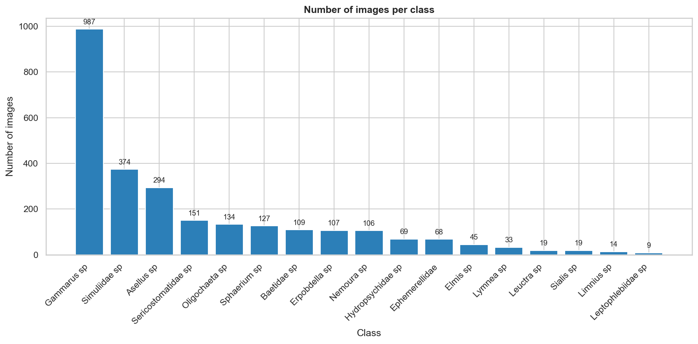
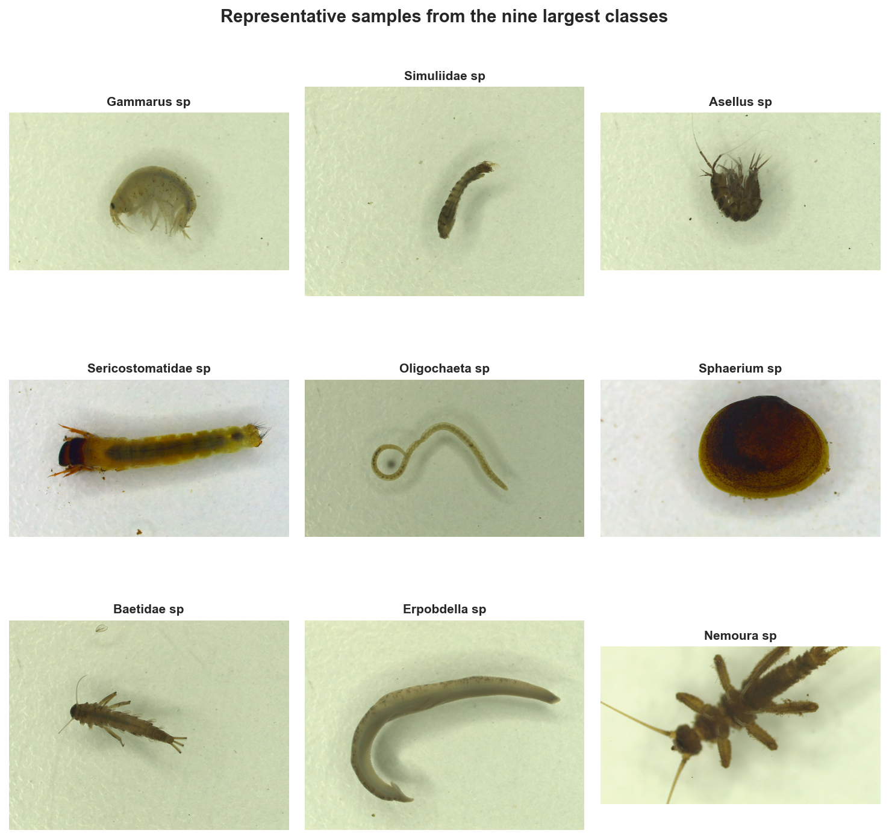
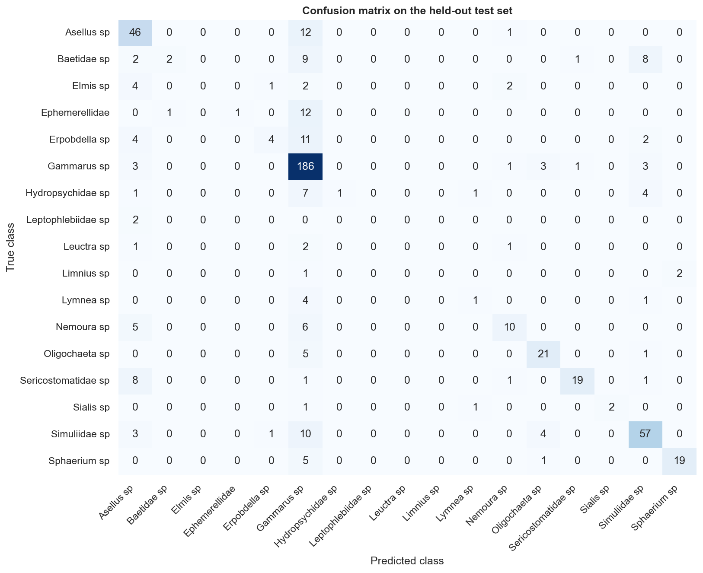

# Implementation Summary

## Stream Macroinvertebrate Image Analysis System

**Repository Link:** https://github.com/emeronbasileo/Assessment_3_Stream-Macroinvertebrate_Image_Analysis_System-

Owen, Emerson, Mica

## Project Goal

Our ultimate goal is to create a Python application that analyses and classifies images of stream macroinvertebrates from the Kaggle Stream Macroinvertebrates dataset. The system/program should be able to perform exploratory analysis of the 17-class image collection and train a baseline classifier that the deployed app uses to make predictions. The system should incorporate a Tkinter desktop GUI for predicting the species in a new image. A menu-driven console application is provided as a backup demonstration path, and a command-line runner reproduces the full pipeline in a single command.

## System Design Overview

The codebase should follow a service-oriented, object-oriented design where one class connects all the others.

Each of the five service classes handles one part of the work:

- DatasetIndexer - Indexing the Dataset
- EDAService - Generating exploratory visualisations and summary statistics
- Image Preprocessor - Preprocessing images into feature vectors
- ClassifierService - Training and persisting the baseline classifier
- WorkflowService - connects the others into the actions every entry point uses

We also need 3 entry points:

- Main.py - command-line
- app.py - Tkinter GUI
- Console_app.py - Menu-driven console

However, all classes delegate to WorkflowService, so the meaning of "run EDA", "train classifier", and "predict an image" is defined in exactly one place. Path constants and image-processing parameters live in **config.py**; shared plotting helpers live in utils/plotting.py.

The project targets Python 3.12. numpy is pinned below 2.3 in requirements.txt for compatibility with the resolved scikit-learn and opencv-python stack.

## Class and Module overview

| Class | Module | Responsibility |
|---|---|---|
| ImageRecord | src/models/records.py | Dataclass - file path, label, width, height, channels (cannot be changed once created). |
| DatasetIndexer | src/services/dataset_indexer.py | Recursively scan data/raw/ and build a DataFrame of records. |
| EDAService | src/services/eda_service.py | Generates class distribution chart, size distributions, sample grid, and summary statistics. |
| ImagePreprocessor | src/services/image_preprocessor.py | Load → Grayscale → resize → normalise → flatten one image to a feature vector. |
| ClassifierService | src/services/classifier_service.py | Build feature/label matrices, Train RandomForest, evaluate, and persist the model to .joblib |
| WorkflowService | src/services/workflow_service.py | Connects the others; the only class every entry point uses |
| MacroApp | src/app.py | Tkinter GUI (Deployment) |
| ConsoleApp | src/console_app.py | Menu-Driven console - backup |

## Python Packages - Why was it used?

| Package | Why was it used |
|---|---|
| pathlib | Cross-platform, readable path handling - replaces fragile string concatenation. |
| pandas | Tabular storage of indexed image records, enabling EDA via group-by and aggregation. |
| numpy | Numeric arrays underpin image features and the model input matrix. |
| opencv-python (cv2) | Image I/O, grayscale conversion, and resizing - fast and standard for computer vision. |
| matplotlib + seaborn | EDA visualisations: count plots, histograms, sample grids, and a confusion matrix heatmap. |
| scikit-learn | Stratified train/test split, RandomForestClassifier baseline, accuracy/classification report/confusion matrix. |
| joblib | Persist the trained model to disk so the GUI can load it without retraining. |
| tkinter | Standard library - no extra install required for the desktop GUI. |
| Pillow | Render the chosen image as a thumbnail inside Tkinter via ImageTk.PhotoImage. |

## Key Features Implemented

### Stage 1 - Exploratory data analysis

EDAService.run_all() indexes the *data/raw/<class>/<image>* layout via DatasetIndexer (which uses *cv2.imread* and skips non-image files such as desktop.ini), then writes four files into outputs/eda/:

- *Class distrinution.png* - sorted bar chart of image counts per class, annotated with each class's count.
- *Image_size_distribution.png* - width and height histograms with mean indicator lines.
- *Sample_grid.png* - 3x3 grid of representative images from the nine largest classes
- *Summary_stats.txt* - totals, dimension ranges, channel composition, and per-class counts.

**Findings on the real dataset (2,665 images, 17 classes):**

- **Severe class imbalance - ratio 109.7x.** The largest class is Gammarus sp with 987 images; the smallest is Leptophlebiidae sp with 9 images. Five classes have ≤19 images each.
- Image widths are nearly constant (~600px), but heights are bimodal at ~325 px and ~450 px (range 274-600px). All images are 3-channel (BGR)

**Implications for downstream design**

- Resizing every image to *128x128* normalises the discrete dimensions onto a common grid before flattening.
- Converting the grayscale before flattening reduces the feature dimensionality from 49,152 (128x128x3) to 16,384 (128x128), keeping the RandomForest fast enough to train.
- *Stratified* train/test splitting preserves class proportions, so rare classes still appear in the held-out evaluation set.
- In Stage 3, *showing prediction confidence* in the GUI gives the user a signal of model uncertainty - directly motivated by the imbalance.

*Figure 1. Class distribution across the 17 species - the headline EDA finding (109.7× imbalance).*

*Figure 2. Sample grid of representative images from the nine largest classes.*

### Stage 3 - Tkinter GUI Deployment

MacroApp opens a 620x550 fixed-size window with the following workflow:

- The window opens with a "No image selected" placeholder.
- *Choose Image* opens a file dialogue filtered to .jpg, .jpeg, .png, .bmp. The chosen file's extension is re-checked after the dialogue (since "All files" can override the filter), and the image is rendered as a thumbnail via Pillow.ImageTk.
- *Predict* loads the saved .joblib classifier, runs the same ImagePreProcessor pipeline used during training, and displays the predicted species and confidence percentage.

Four error paths are handled with tkinter.messagebox, none of which crash the window:

- Predict click with no image selected → warning dialogue.
- Unsupported file extension → error dialogue listing supported types
- Image cannot be opened by Pillow → Error dialogue
- No trained model file found → error dialogue with a hint to run python -m src.main.

Internally, the baseline classifier that powers prediction is a scikit-learn *RandomForestClassifier* (100 trees, random_state=42, n_jobs=-1). It trains in approximately 34 seconds on 2,132 images x 16,384 features and reports an accuracy 0.6923 on the 533-sample held-out test set. Macro F1 is 0.39 - much lower than weighted F1 (0.64), reflecting exactly the imbalance the EDA predicted: *Gammarus sp* recall is 0.94 (the model defaults to it), while five rare classes have 0% recall. This is recorded in outputs/reports/classification_report.txt and visualised in *outputs/reports/confusion_matrix.png*.

*Figure 3. Confusion matrix on the held-out test set - the model concentrates on the larger classes.*

## Testing Summary

All five testing scenarios were performed manually and recorded in MANUAL_TESTING, with the corresponding screenshots stored in docs/test_screenshots/. All five passes.

| # | Scenario | Entry point | Result |
|---|---|---|---|
| 1 | Predict before training | GUI | Pass - friendly error dialogue with retraining hint. |
| 2 | No image selected before Predict | GUI | Pass - warning dialogue. |
| 3 | Unsupported file type | GUI | Pass - error dialogue listing supported extensions. |
| 4 | Invalid menu choice | Console | Pass - "Invalid option" message and reprompt. |
| 5 | Valid end-to-end prediction | GUI | Pass - Gammarus sp (74.00% confidence) on a known image. |

## Reused/adapted code acknowledgement

The following unit materials were adapted, with attribution comments at the top of each affected module:

- **Week 5 ST1 TUT - NumPy & OpenCV foundations.** Cv2.imread, cv2.cvtColor and cv2.resize patterns. Adapted into ImagePeprocessor.
- **Week 6 ST1 TUT - Keras image handling activity. Task 1_5.** Pixel normalisation by 1.0/255.0. Adapted into ImagePreprocessor; modified to operate on a single grayscale image rather than a batched Keras tensor.
- **Week 7 ST1 TUT - MobileNetV2 transfer learning notebook,** the predict_new_images function. The inference loop pattern (load → Preprocess → predict → display class with confidence percentage). Adapted into MacroApp and ConsoleApp; modified to use the project's sklearn pipeline (rather than a Keras model), to render via Tkinter or console output rather than matplotlib, and to go through WorkflowService so all entry points work the same way.

The Week 7 transfer-learning model itself was not copied - this project uses a scikit-learn RandomForestClassifier baseline as its (internal-only) Stage 2 component.

## Limitations and possible improvements

The baseline classifier achieves 0.6923 accuracy with significant class-imbalance effects: the largest class dominates predictions, and several rare classes are not learned. This is acceptable for the current scope - the predictive component supports the deployed application rather than being assessed as a marked stage - but here are the things we could try next:

- Address the imbalance directly via class-weighted loss, oversampling, or synthetic minority generation.
- Replace flattened pixel features with a transfer-learning model (for example, MobileNetV2 used as a fixed feature extractor, as introduced in the Week 7 unit material) to capture the shapes and structure that the current flattened-pixel approach loses.
- Cache the indexed DataFrame to disk so repeated EDA runs during development do not re-decode every JPEG.
- Extend the GUI to support batch prediction over a folder, with a CSV export of results.
