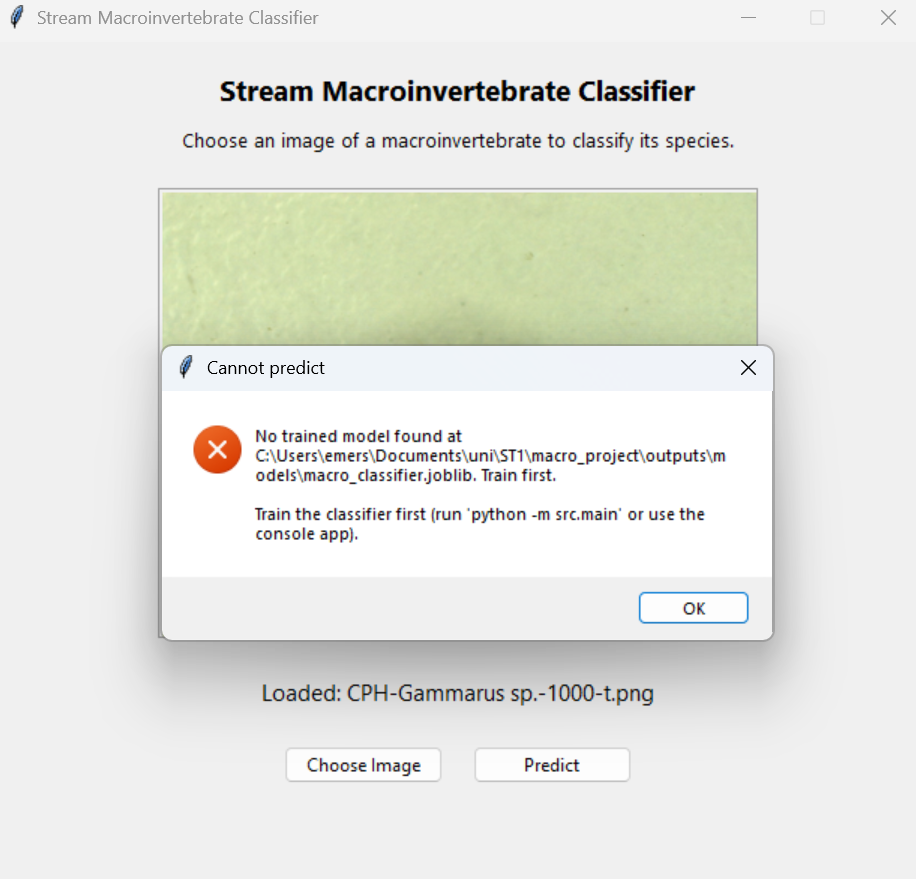
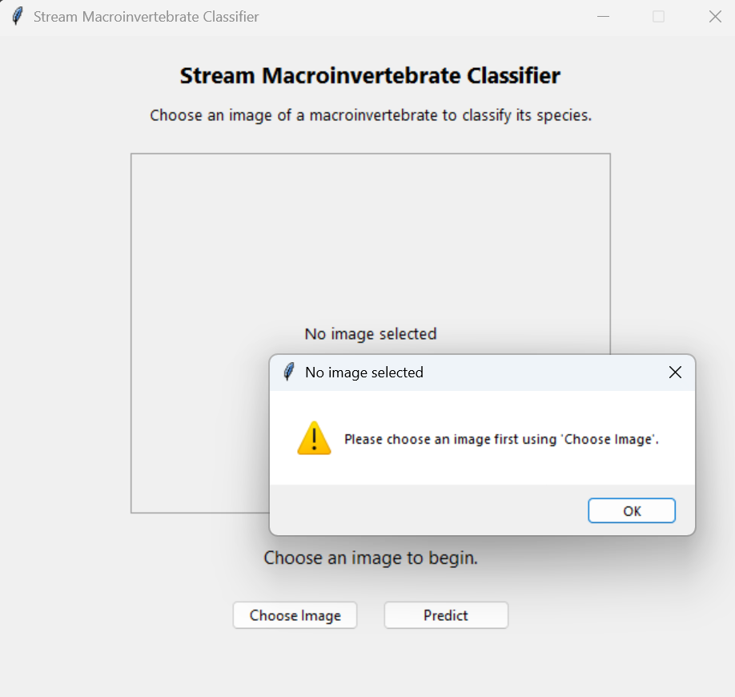
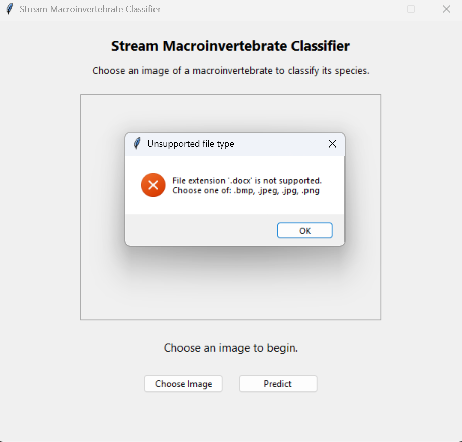
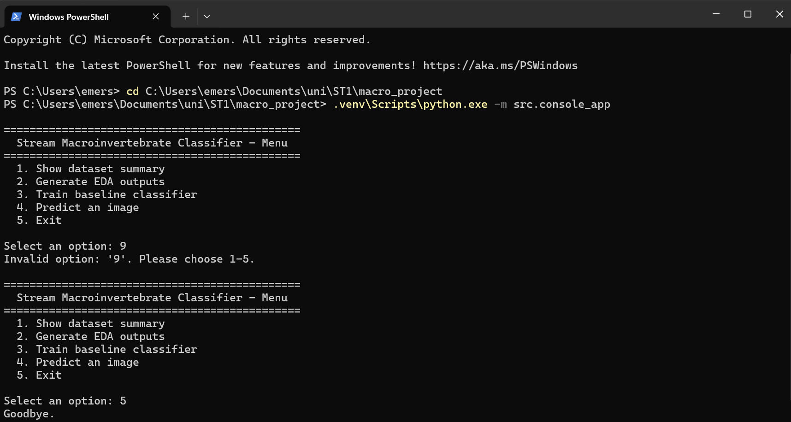
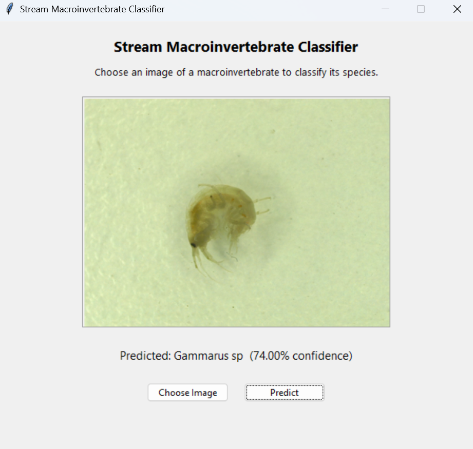

# Manual Testing

## Stream Macroinvertebrate Image Analysis System

| Project | Stream Macroinvertebrate Image Analysis System |
|---|---|
| Group | Group 4 |
| Members | u3318477, u3334531, u3323255 |
| Unit | Software Technology 1 (4483) |
| Assessment | Assignment 3 - Group Project |

## Testing approach

Each system was tested manually before we submitted the project. Manual testing was chosen as the application's correctness is easily observed at the user-facing layer (a Tkinter GUI and a console application), and because the classifier produces probabilistic outputs that are not well suited to exact-value assertions. Five distinct scenarios were performed, covering the system's happy path and its four documented error paths. Each scenario was reproduced from a clean application launch.

## Test scenarios and results

**Scenario 1 -** Predict clicked before classifier has been trained (model file missing) Entry point: Tkinter GUI Result: Pass. An error dialogue was displayed with a hint to run python -m src.main. The application did not crash and remained responsive.

**Scenario 2 -** Predict clicked with no image selected Entry point: Tkinter GUI Result: Pass. A warning dialogue was displayed. After dismissal, the GUI remained responsive, and an image could be selected normally.

**Scenario 3 -** Unsupported file type selected (.txt file chosen with "All files" filter) Entry point: Tkinter GUI Result: Pass. An error dialogue was displayed listing the supported extensions (.jpg, .jpeg, .png, .bmp). No image was loaded.

**Scenario 4 -** Invalid menu choice entered (9, empty input, abc) Entry point: Console application Result: Pass. Each invalid entry produced an "Invalid option" message and re-prompted the user. The application did not crash.

**Scenario 5 -** Valid end-to-end image prediction on a known sample Entry point: Tkinter GUI Result: Pass. The image rendered as a thumbnail. Predict returned Gammarus sp at 74.00% confidence within approximately 1 second.

